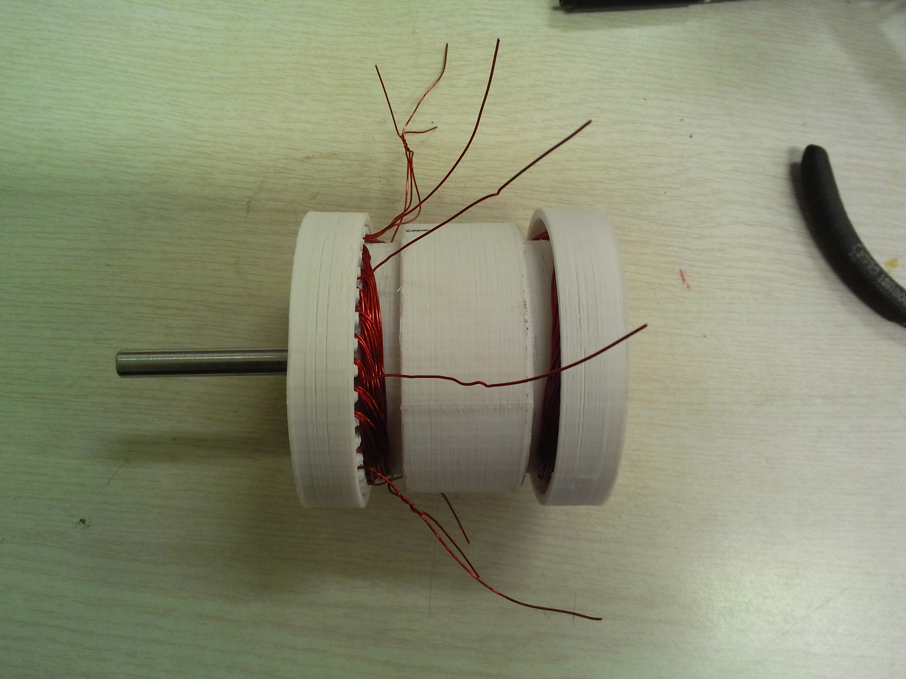

##3d printed bldc motor
##3D打印无刷直流无铁芯电机

I designed and made an easy to make 3d printed bldc(brushless DC) motor a year ago(2016). 

Technically, it is called 3d printed brushless DC coreless motor. It's called coreless because it don't have an iron core(of course I can't 3d print an iron core which needs thin slices of laminated steel plate). 

This motor is just mainly for learning purpose. It can make you learn how motor move and how to wind the motor winding.

This Git is for sharing my bldc 3d model(solidworks, stl files), and also my records on making them.

I shared this making process on [DRrobot](http://www.dfrobot.com.cn/community/thread-15399-1-1.html) in Chinese.

The [youtube](https://www.youtube.com/watch?v=lS0N3Dqtprc&lc=z23mcnmxcymftljrf04t1aokgwxxaa5vngsrcyvqkjhtrk0h00410) video of testing this motor

在中国不能翻墙的用户，我在[优酷](3D打印无刷直流无铁芯电机)也传过视频。具体制作细节在[DFRobot](http://www.dfrobot.com.cn/community/thread-15399-1-1.html)上有写。

